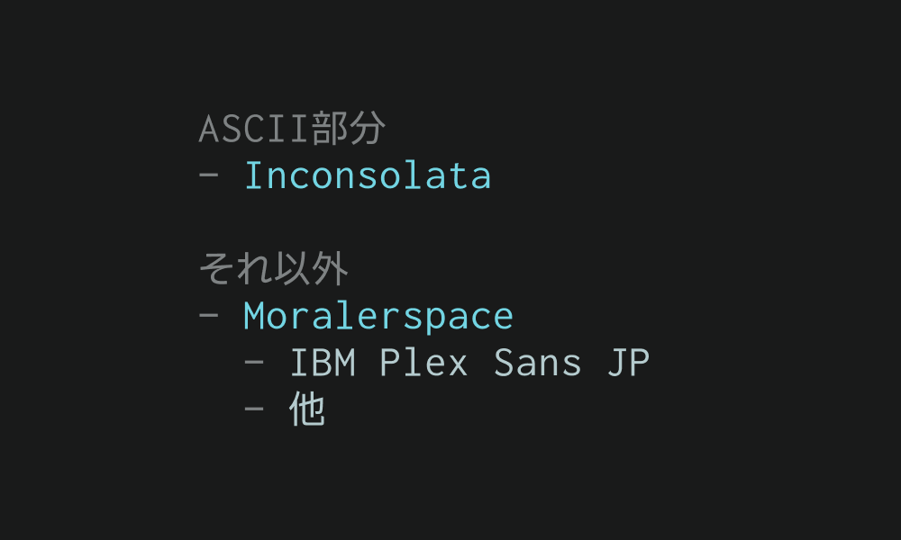

# Intmor

Intmor（イントモア）は、InconsolataとMoralerspaceを合成したプログラミング用の等幅日本語フォントです。

[ダウンロード](https://github.com/2n/intmor/releases) （Assetsの `Intmor_v*.*.zip` から）

## 合成元フォント

### ASCII部分はInconsolata

- 視認性向上のため一部を微調整

### ASCII以外の部分はMoralerspace（JPDOC版のNeon）

- 日本語部分はIBM Plex Sans JP
- 全角と半角の文字幅比率が5:3
- 全角スペースの可視化など

## サンプル

## 免責事項

本フォントは自己責任のもとでご使用ください。本フォントを使用することによって生じた、利用者及び第三者に対する損害等について、本フォントの制作者は一切の責任を負いかねます。

## ライセンス

本フォントは[SIL Open Font License (OFL) version 1.1](https://openfontlicense.org)のもとで公開されています。
